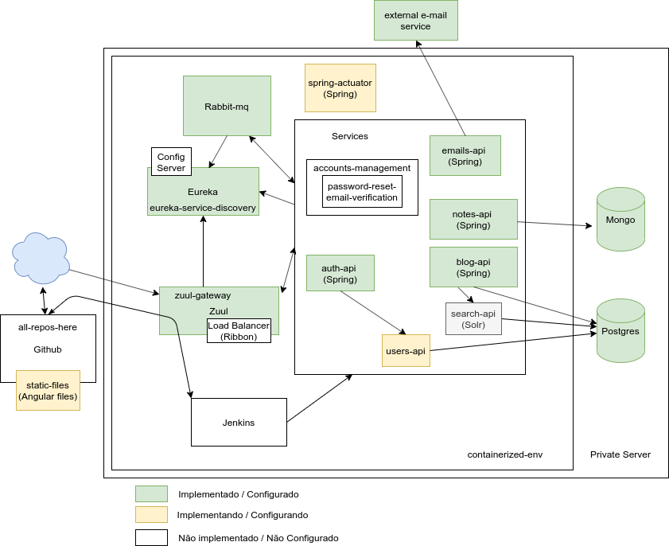

# docker-files

Este repositório contém a grande maioria das configurações docker que tenho utilizado em meus 
experimentos. São uma série de aquivos docker e arquivos docker-compose que utilizo para subir
algumas aplicações que são necessárias nos meus desenvolvimentos.

## projects-infra 

[Neste diretório](./projects-infra) do repositório está um docker-compose com alguns serviços
(APIs + dependências) que implementei e configurei e que estou utilizando como objeto dos meus estudos. 
O diagrama abaixo mostra a estrutura montada:

Todos os componentes da estrutura estão sendo evoluídos aos poucos, sendo que o único objetivo de toda
essa estrutura é apenas aprendizagem. Cada um dos respectivos serviços você pode encontrar nos meus repositórios
do github.
